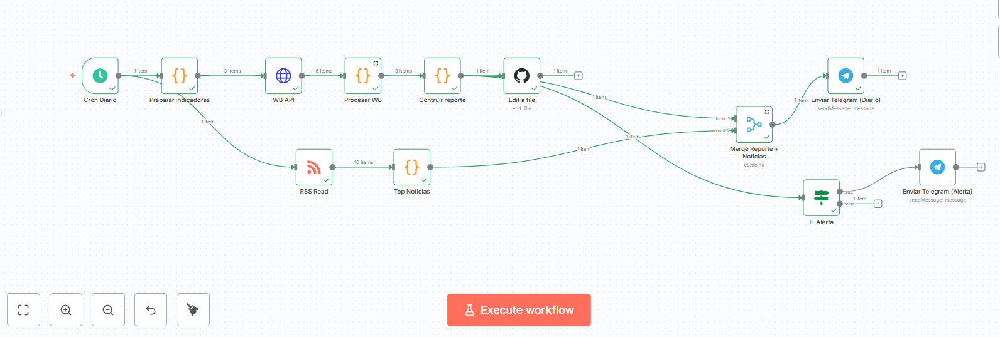
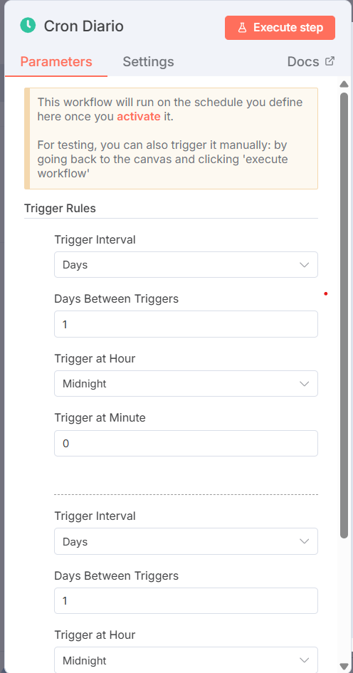

# Equipo: Alvaro Javier Mutis Guerrero
# Jose Luis Bedoya Martinez

## Planteamiento del Problema:
El aumento en la disponibilidad y acceso a la información tiene dos caras en cuanto a su abordaje: por un lado, se nos promete poder acceder a la información que requerimos " a un clic" y, por otro lado se pone a nuestra disposicion tantas fuentes y tanta información que poder seleccionar la información que realmente requerimos puede ser un trabajo tan arduo que nos obligue a navegar horas y horas buscando los datos que requerimos para la toma de decisiones. Y surge la paradoja de la sociedad actual: Si bien tenemos la información a un clic de distancia, obtener la información requerida nos puede llevar cientos de clics y luego una tabulación de los datos que habilite su aprovechamiento, lo cual se traduce en tiempos y posibles errores en la recopilación.

Afortunadamente, la misma tecnología que nos lleva a la paradoja antes mencionada, pone a nuestro alcance las herramientas para encontrar una solución: la automatización de tareas a través de agentes que, ahora si, ponen a nuestra disposicion la información de interes, incluso, sin dar un clic (una vez creado el bot, como es obvio)

En este trabajo veremos la implementación en n8n de un bot que diariamente recopila informacion para Colombia de los indicadores de Desempleo, inflación y PIB a través del API del banco Mundial. Del mismo modo, con el fin de tener noticias de transcendia en el dia muestra las principales noticias de la revista Portafolio. Esta información es enviada a los integrantes de un canal de telegram de tal modo que a las 8 am de cada dia puedan tener en sus manos la información de interés. Por último, los datos de indicadores son almacenados en un csv en un repo de github para mantener el historico de la información de los indicadores recolectada lo que habilita la creacion posterior de reportes y sus analisis
## Justificación de la Tecnología: 
Resolver el problema planteado tiene una buena cantidad de enfoques que nos permitirían obtener el mismo resultado por lo que la elección de la tecnología, como en otros casos, incluye criterios mucho mas amplio que la simple solución efectiva del problema; por lo general, a nivel industria, los principales criterios son los costos en terminos economicos y de tiempo en cada una de las fases del ciclo de desarrollo y operacionalización de la solución.

Dentro de las opciones se podia elegir realizar una implementación con githun action y python lo que en reduce costos en su etapa de operacionalización pero los incrementa significativamente en los costos de implementación. Adicionalmente hace que la solución tarde mucho mas tiempo en estar disponible para su uso lo que se traduce en tiempos invertidos por todos los interesados de la información.

En nuestro trabajo hemos escogido realizar la solución en n8n por varias razones:
1. La naturaleza del problema no nos pone como reto tener que realizar actividades complejas de ETL pues los datos son fácilmente extraidos a través de la API.
2. Facilidad en la implementación lo que disminuye significativamente los tiempos de implementación de la solución.
3. Posibilidad de utilizar API´s para la obtención de los datos y realizar la extracción de los datos 
4. Soporta las interacciones con github y telegram sin mayor dificultad
5. La solución es escalable pues permite introducir nuevos nodos para mejorar funcionalidad

Existen un punto adicional y es cuando lo llevamos al contexto de aprendizaje en el cual nos encontramos inmersos: la decision de usar n8n es tener la posibilidad de explorar una herramienta poderosa que puede ser de utilidad en el futuro en el desempeño de nuestras labores.

## Guía de Uso: Explicación del funcionamiento del flujo y las instrucciones para configurarlo.

Se muestra inicialmente el flujo completo para tener una visión general de su composición:

EL disparador del flujo se configura a través de un cron diario que se programa para ejecutarse a las 8 am de cada dia y solo basta con introducir los parametros como se muestra en la siguiente figura: 

!

El flujo continua en dos caminos:
Por una parte se prepara un json que contiene los indicadores de interes que serán consultado en la API del banco de la republica, estos son tomados por el nodo de scrapping y llevados a un script en javascript que toma los resultados entregados por la API y los lleva a un formato tabular para luego ser escritos en el archivo indicadores_co.csv del repositorio en Github. En este punto es importante mencionar que la comunicacion entre n8n y Github requiere de un token de seguridad que habilita la escritura en el repo respectivo.

Configuraciones importantes:
1. API WB: Metodo: Get; Url: https://api.worldbank.org/v2/country/CO/indicator/{{$json["indicator"]}}?format=json&per_page=60
2. Github: Connection: Autenticacion con token a través de la API; Recurso: File;Operacion: Edit; File Content:{{$json["csv"]}} (desde “Construir reporte”); Commit message: chore(data): update indicadores_co {{$json["fecha"]}}

Por otro lado el flujo contiene un nodo que se conecta a la API de la revista Portafolio donde basta con colocar la url correspondiente: https://www.portafolio.co/rss/economia
La respuesta del API es pasada en el siguiente nodo a un script escrito en Javascript el cual toma el top 5 de las noticias.

Ambos flujos confluyen a un nodo Merge que toma ambas fuentes y las enruta al API de Telegram que se encarga de notificar tanto los indicadores como los 5 principales titulares de la revista portafolio.

Por último, el json "Construir Reporte" incorpora una función para generar alertas ante cambios grandes en los valores obtenidos el cual se tramita con un nodo condicional que examina la señal de alerta y enviandola a Telegram en caso de ser True, dando con esto un valor agregado frente a los simples valores advirtiendo al usuario del cambio presentado

El bot generado contiene elementos fundamentales que permiten experimentar sobre el potencial de la herramienta y sus fortalezas para la automatización de tareas
